# Module 1 React Essentials Homework

While having lunch, your CTO and your Tech Leader met and discussed about a technology that most big companies are using which improves code maintenance and reusability by using components. They ended up agreeing that React could indeed help BigCorp deliver the best lottery website.


### Homework management 🏠

The final result of all homework is the React Native Application full of features implemented iteratively in the end phase of each module in the course. In order to keep consistency and track all of your changes we highly recommend you to create your own GitHub repository where your work as a participant will be stored. Your GitHub repository should be shared with all trainers, which will enable us to verify your work and communicate:
- Tomasz Leśniakiewicz - https://github.com/rinej
- Bartłomiej Tomczyk - https://github.com/barttom
- Michał Staniewski - https://github.com/michalstaniewski-cs

Each module in the course will end up with homework consisting of a few tasks to fulfil. We would like to suggest a comfortable system for you to submit each task of the homework as a separate PR to the main branch in your repository. This will create a space for us to communicate with you, by doing code reviews - thanks to that we will be able to check your homework, discuss some uncertainties, or respond to questions you will leave in the PR. In case you have any trouble with homework you can always book a 1 to 1 session with the trainer, and also don't hesitate to ask your questions in the dedicated communication channel. Keep in mind that you don't have to worry about being blocked for the next homework, every homework will have a starting point, so you always will be able to override the content of your repository with the prepared starting point.

### The goal of this module’s homework

The goal of this homework is to migrate the web application that was developed in previous modules to React, improve it and add some new features.

### Checkpoints 💡

The homework repository contains periodic checkpoints for your convenience. You will see callouts denoting the current checkpoint throughout this instruction. They will look something like this:


> 💡 You are now here → `checkpoint-xyz`

Feel free to check out the corresponding branch of any given checkpoint if you’re struggling or simply want to compare your solution with ours.

With that out of the way, let’s start!

## Setup
Fork the repo and add access for the mentors. Below you find the instruction, how to run the boilerplate.

### Backend
We prepared a simple server for the homework. To run it you need to additionally add redis database adn add credentials for the project.
For Redis databae we use upstash service.
<br>
1. Open https://upstash.com/, click 'Start for free' and create an account.
2. Click 'Create database' button.
3. Fill the information like name, region et.c - it's up to you. Then click 'Next' button.
4. Select 'Free' plan and go to the next step.
5. In the summary step click 'Create' button. you should see a settings page for your new database.

After creating a database setup credentials to connect  in our server <br>
1. Copy `backend/.env.template` to `backend/.env`
2. Fill the data for you database
```
REDIS_ENDPOINT=
REDIS_PASSWORD=
REDIS_PORT=
```
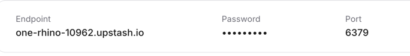
#### Running teh backend
After configuration you can run the backend
```bash
cd backend
```
```bash
npm run dev
```
### Web
After running the server we are ready to run our React app
1. Copy `web/.env.template` to `web/.env`.
2. Setup backend server. By default should be `VITE_API_URL=http://localhost:3000`

#### Running teh React app
After configuration you can run the backend
```bash
cd web
```
```bash
npm run dev
```

## Part 1: Add a lottery

Given the UI design implement Add a lottery feature. 

<details>
  <summary><b>Add lottery FAB button</b></summary><br>


</details>

<details>
  <summary><b>Add lottery modal</b></summary><br>

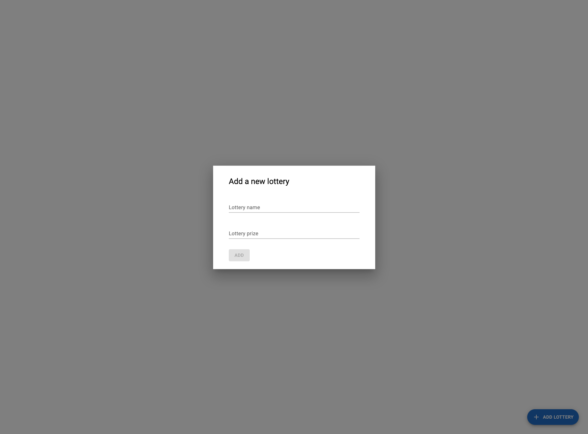
</details>

<details>
  <summary><b>Add lottery modal form validation</b></summary><br>

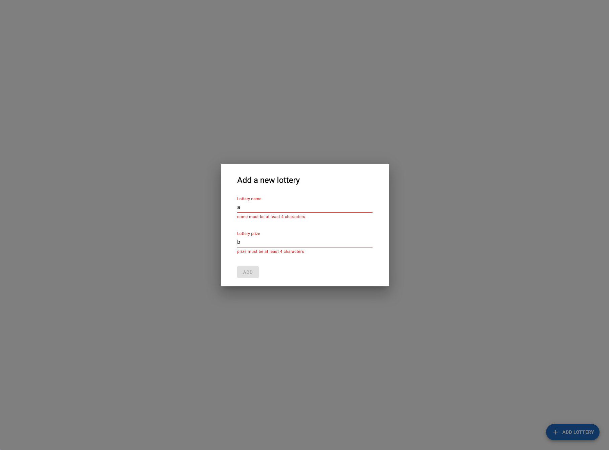
</details>

<details>
  <summary><b>Add lottery loading state</b></summary><br>

  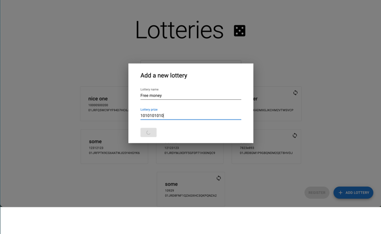
</details>

<details>
  <summary><b>Notification after successful action</b></summary><br>


  
</details>

Add lottery feature should have following things implemented:

- FAB button to open a modal
- Modal with a form to add a new lottery
- Forms should be validated
- Loading state should be present when form is submitted
- After successful form submission modal should close automatically and Notification with a message should open

Helpful resources:

- https://formik.org/ and https://github.com/jquense/yup can be used to implement form validation
- Modal component - https://mui.com/material-ui/react-modal/
- Notification component - https://mui.com/material-ui/react-snackbar/
- LoadingButton component from MaterialUI is a part of a complimentary library -https://www.npmjs.com/package/@mui/lab

> 💡 You are now here → https://github.com/callstack-workshops/01-Hello-Fresh-training-homework/tree/checkpoint-1

## Part 2: List lotteries

Given the UI design implement List lotteries feature. 

<details>
  <summary><b>Fetch and display lottery data</b></summary><br>

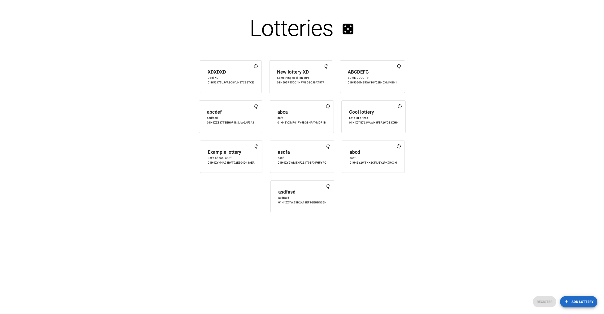
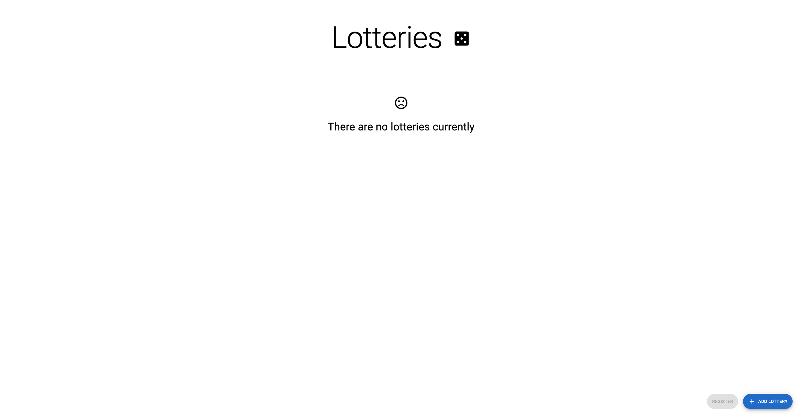
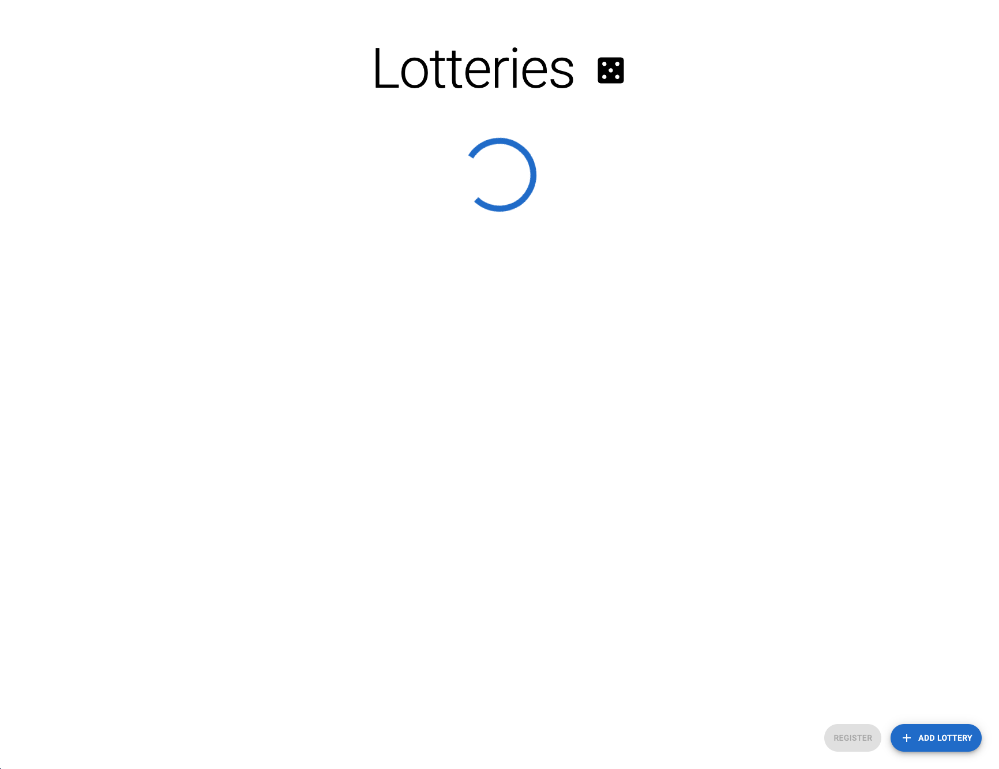


</details>

<details>
  <summary><b>Make lotteries selectable and add register FAB button</b></summary><br>

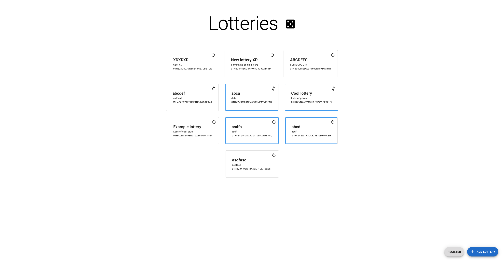
 
</details>

<details>
  <summary><b>Add Register modal with name input and validation</b></summary><br>

  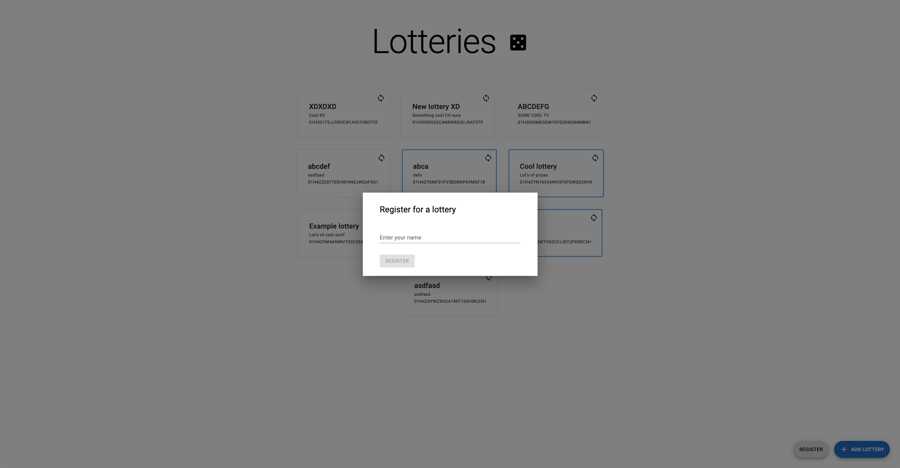
</details>

<details>
  <summary><b>Register to selected lotteries and notification message</b></summary><br>

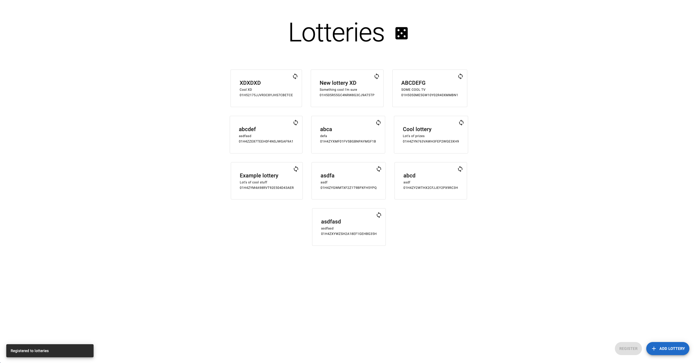

</details>

List lotteries feature:

- Should display list of lotteries
- Adding a new lottery should re-fetch the lotteries
- Lotteries should be selectable by clicking on them
- Finished lotteries should be grayed-out and not be selectable as we are not able to register for them
- Register FAB button should open a modal to register for selected lotteries
- Register FAB button should be disabled when no lotteries are selected
- Register modal should close after successful submission and notification with a message should be shown

> 💡 You are now here → https://github.com/callstack-workshops/01-Hello-Fresh-training-homework/tree/checkpoint-2

## Part 3: Filter lotteries

Given the UI design implement Filter lotteries feature.

<details>
  <summary><b>Add text input to filter fetched lotteries</b></summary><br>

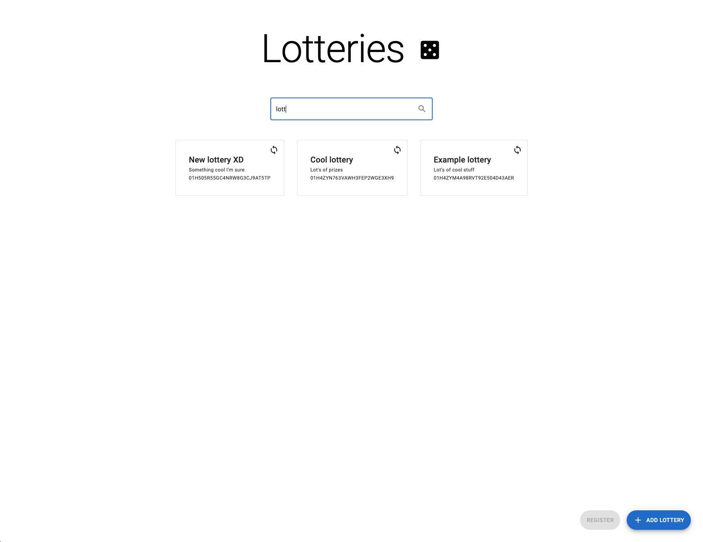

</details>

<details>
  <summary><b>Handle no search result case</b></summary><br>

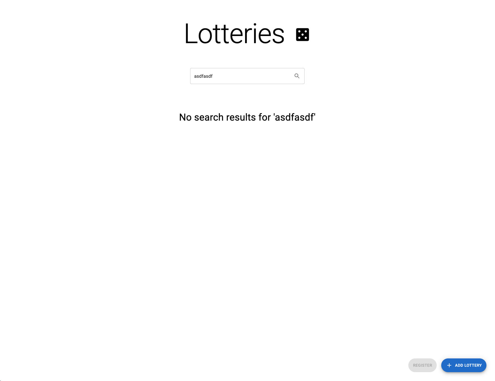

</details>

Filter lotteries:

- Should have text input to with a search icon
- Typing in the input should filter the results
- When there are no search results for a given filter, no search result information should be displayed

> 💡 You are now here → https://github.com/callstack-workshops/01-Hello-Fresh-training-homework/tree/checkpoint-3

## Finish
🎉 Congratulations, you have finished the homework! Feel free to send solutions as a pull requests to your mentors.
